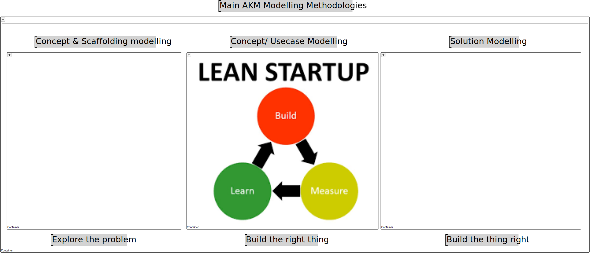
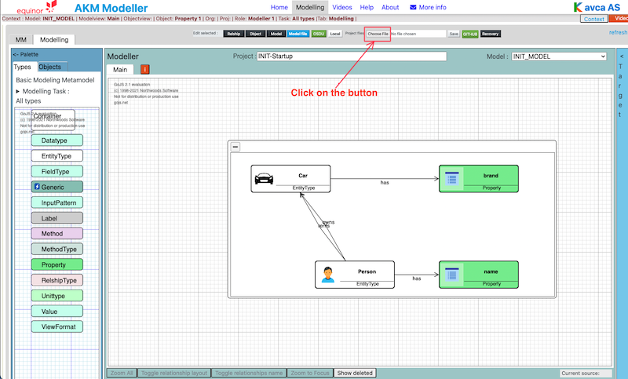

| Readme | [Project](https://github.com/orgs/Kavca/projects/3) | [Upload models](UploadModels.md) | [About](about.md) | 

# Kavca Dementia Models

Click on the links below to open the models in AKM Modeller:

- [Dementia Treatment Concepts](http://akmmclient-beta.vercel.app/modelling?focus=%7B%22githubFile%22%3A%7B%22org%22%3A%22kavca%22%2C%22repo%22%3A%22dementia-akm-models%22%2C%22branch%22%3A%22main%22%2C%22path%22%3A%22models%22%2C%22filename%22%3A%22Dementia-Treatment-Concepts_PR.json%22%7D%7D)

---

## Introduction

The Modelling process is based on the following steps:

We adapt this general process to AKM modelling purpose.

Design Thinking (Explore the problem)

  
The Design Thinking process is a user-centric approach to problem-solving that typically involves five phases. It's widely used in various fields, including software development, product design, and business innovation.

    (Here is where we build the Concept_CM model to define and agree on the Concepts in the problem space)

Here's an overview of each phase:

- Empathize: This initial stage involves understanding the users' needs, experiences, and motivations. It often includes observing and engaging with users to gain insights into their behaviors and attitudes. This phase is crucial for establishing empathy with the users, which is a key aspect of Design Thinking.

- Define: In this phase, the insights gathered during the Empathize stage are synthesized into a clear problem statement. This is where you define the core problem you are trying to solve, often in the form of a user-centered problem statement. It sets a clear direction for the project. 

( Idenify where in the overall ladscape the problem is located. Build/update an overall Top-Down model to identify where this is)

- Ideate: Once the problem is defined, the Ideate phase involves generating a wide range of creative ideas to address the problem. This is often done through brainstorming sessions and other ideation techniques. The goal is to explore a broad solution space and think outside the box.

- Prototype: The ideas generated during the Ideate phase are turned into tangible prototypes. These prototypes can range from simple paper models to more sophisticated digital or physical creations. The purpose of this phase is to create a physical or digital representation of the solutions to explore their potential.

- Test: In the final phase, the prototypes are tested with real users. This involves observing how users interact with the prototype and gathering feedback. The testing phase is crucial for understanding the viability of the proposed solutions and for making iterative improvements based on user feedback.

Throughout the Design Thinking process, iteration is key. Based on feedback and insights gained, teams often cycle back to earlier stages to refine their understanding of the problem or to explore new solution ideas. This iterative approach ensures that the final solution is deeply aligned with user needs and has gone through rigorous refinement and testing.

Lean Startup (Build the Right Thing!)

Lean Startup process emphasizes the importance of flexibility, quick iterations, and customer feedback in the development of products or services. The process consists of several key components:

    (This is where we build Typedefinition_TD models to test the Concept models from Design Thinking)

- Build-Measure-Learn Loop: This is the fundamental cycle at the heart of the Lean Startup method. The idea is to turn ideas into products (Build), measure how customers respond (Measure), and then learn whether to pivot or persevere (Learn). This cycle helps startups to quickly test their hypotheses and make adjustments based on real-world feedback.

- Minimum Viable Product (MVP): An MVP is a version of a new product that allows a team to collect the maximum amount of validated learning about customers with the least effort. It's not necessarily the smallest or simplest version of the product, but the one that enables a full turn of the Build-Measure-Learn loop with a minimum amount of effort and time.

- Validated Learning: This concept emphasizes the importance of learning about what customers actually want and will pay for, rather than what you assume they will want. This is achieved by testing a series of MVPs, each designed to test specific hypotheses about the product and the business model.

- Pivot or Persevere: Based on the feedback and data gathered from the MVPs, startups decide whether to pivot (make a fundamental change to the product) or persevere (continue with the current strategy). Pivoting is not seen as a failure but as a necessary part of finding the right product-market fit.

- Continuous Deployment and Innovation Accounting: Lean Startup encourages rapid and continuous deployment of products to accelerate learning and innovation. Alongside this, innovation accounting is used to track progress, set up milestones, and prioritize work. This helps startups to make more informed decisions about when to pivot and when to persevere.

Overall, the Lean Startup methodology is about being more adaptive, customer-focused, and iterative in developing products and services. It's particularly well-suited to the uncertain and fast-changing environments that startups often operate in.

Agile development (Build the Thing Right!)

Agile development is a methodology that prioritizes flexibility, collaboration, customer feedback, and rapid iteration in the development of software products. Originating from the Agile Manifesto, it contrasts with traditional waterfall methods by being more adaptive and responsive to changes. 

    (Here is where we generate/configure Solutions (GraphQL/Database schemas etc.)

Here’s an overview of its key components:

- Iterative Development: Agile development is characterized by short, iterative cycles called sprints, typically lasting from one to four weeks. Each sprint aims to produce a working increment of the product, allowing for frequent reassessment and adaptation of plans.

- Collaboration and Cross-Functional Teams: Agile emphasizes close collaboration between cross-functional teams, which often include developers, designers, and business stakeholders. Daily stand-up meetings (or scrums) are common, where team members discuss progress, plans, and obstacles.

- Customer Involvement and Feedback: Agile methods strongly advocate for regular customer involvement and feedback. This can take the form of user stories to define requirements, reviews at the end of each sprint, and frequent releases to gather real-world user feedback.

- Adaptive Planning: Agile teams plan iteratively and adaptively. While there's an overarching vision or roadmap, detailed planning is only done for the current and next sprint. This flexibility allows teams to respond to changes and new information quickly.

- Continuous Improvement: Regular retrospectives are a key part of Agile. After each sprint, the team reflects on what went well and what could be improved. This continual reassessment aims to enhance efficiency and effectiveness over time.

- Working Software as a Primary Measure of Progress: In Agile, the primary measure of progress is the delivery of working software. The focus is on creating software that is functional and adds value to the customer, rather than strictly adhering to a predefined plan.

- Sustainable Development: Agile promotes sustainable development practices. The goal is to maintain a consistent pace and avoid burnout, ensuring that the team can continue to deliver high-quality work indefinitely.

Agile methodologies include various frameworks like Scrum, Kanban, and Extreme Programming (XP), each with its own specific practices and tools but sharing the core principles of the Agile Manifesto. Agile is widely adopted in the software development industry due to its flexibility, efficiency, and focus on delivering tangible, customer-centric results.

---

## AKM Modeller

Open AKM Modeller:  

<https://akmmclient-main.vercel.app/modelling> the most tested version, but may lack some features

<https://akmclient-beta.herokuapp.com/modelling> more tested version without latest features

<https://akmclient-alfa.herokuapp.com/modelling> bleeding edge version with latest featuress not well tested

(You can switch version by clicking on the dropdown menu "V." in the main menu of AKM Modeller)

---

## To start a new model project

Click on the GitHub button in the top menu to open the GitHub download dialog.

Fill in the dialog:

RepoOwner: "Kavca"
Repository: "kavca-akm-models"
Path: "startmodels"

Clik the "LIST MODELS" button to list the models in the repository.
Select one of the start models and click "DONE"

To rename the project, model and modelview, select the "_ADMIN_MODEL in the model dropdown menu.

- Change the name of the project object to your project name.
- Change the name of the Model object to your model name.
- Change the name of the Modelview object to your modelview name, i.e. "01-Main".

Right click the background and select "Update Project from AdminModel.

Click refresh (Blue text in the top right corner)

Now you can start modeling.

---  

***(In AKM Modeller)***

Select "Modelling" in the top menu.

## Open and save local files

### 1. Open a Project.json file in AKM Modeller

Open local project files: <code> Click: "Choose file" button</code>

Click on: Project files: "Choose file" button and select the project file you want to load (.json file).

The selected file will be loaded in the AKM Modeller.

---

### 2. Then Work with your model project

See the documentation how to used AKM Modeller in "Help" in top menu.

---

### 3. Save your model project to Local Project.json file

To save local project files: <code> Click on: "Save" button</code>

To save the current project.json file Click on the "Save" button.

The file will by default be saved in Download folder as a "Projectname".json file.

---
---

## Open and save models on GitHub repository

To open a model stored on GitHub repository:

Open GitHub repository AKM project files in AKM Modeller: <code> Click on: "GitHub" button</code>

..

Click on "GitHub" button to open the dialog for GitHub repository and fill in the required fields.

- Repository URL:  <https://api.github.com/users/UserName/repos/>

then click on: "LIST MODELS" button and then select a model in the "Select Model" dropdown list.

(The list is from the **main** branch of the repository.)

The model will be loaded in AKM Modeller.

Click on "X" button in the top right corner to close the GitHub repository select dialog.

---

---

To upload a model to GitHub repository:

First make sure you have saved your Project.json file locally (the model you want to upload), as described in item 3 above.

[Procedure for uploading to Github repository](UploadModels.md)

