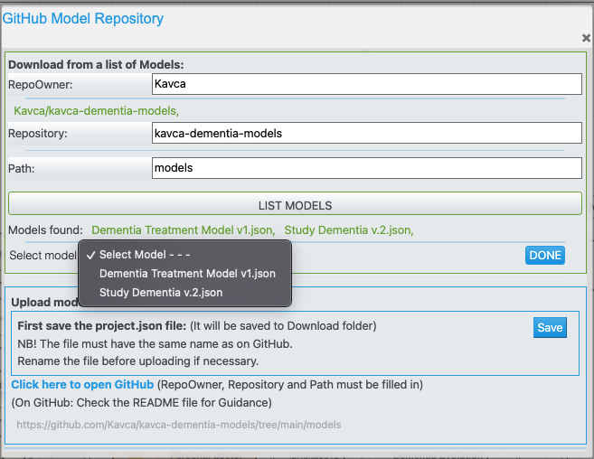

# This folder contains AKM-Model-files.  (.json files)

To open a model-file in AKM Modeller:

1. Open:  <http://akmclient-beta.herokuapp.com/modelling>
2. Click on the GitHub button in the menu over the modelling area.
3. In the dialog window type in following info:

4. Click Select Model and choose the model-file you want to open.
5. The Project.json file will be loaded into the modelling area.
   
